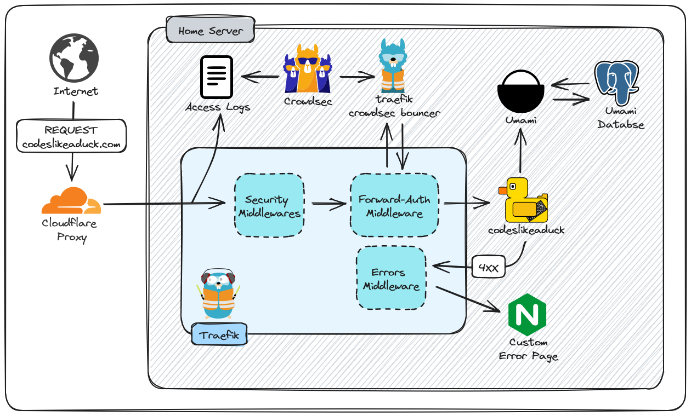

#  codeslikeaduck.com     

- The site is self-hosted, set up in a [Hugo docker container](https://github.com/klakegg/docker-hugo#readme) with request routing handled by [Traefik](https://github.com/traefik/traefik#readme). 
- It's a [Hugo](https://gohugo.io/) site using the [Terminal](https://github.com/panr/hugo-theme-terminal) theme with some minor CSS tweaks.
- An [Umami](https://github.com/mikecao/umami#readme) instance runs alongside for web analytics, [viewable here](https://umami.codeslikeaduck.com/share/Ljt3LRkD/codeslikeaduck). 
- HTTP status errors are routed to a seperate [nginx](https://hub.docker.com/_/nginx) instance that serves one of two [404 pages](errorPage/html). 

### Network Diagram

 

## License

- The website [theme](https://github.com/panr/hugo-theme-terminal) is released under the [MIT Licence](https://github.com/trev-dev/hugo-theme-terminal/blob/master/LICENSE.md).
- The error pages are edits of [two](https://github.com/tarampampam/error-pages/blob/master/templates/lost-in-space.html) [pages](https://github.com/tsparticles/404-templates/tree/main/bee) both under MIT Licence.
- All edits/additions of my own are under [BSD 2-Clause](LICENCE).
